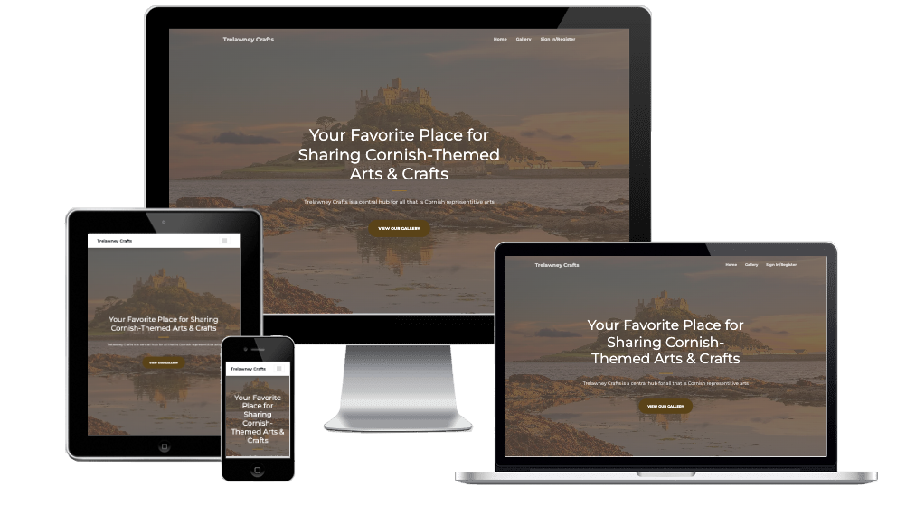
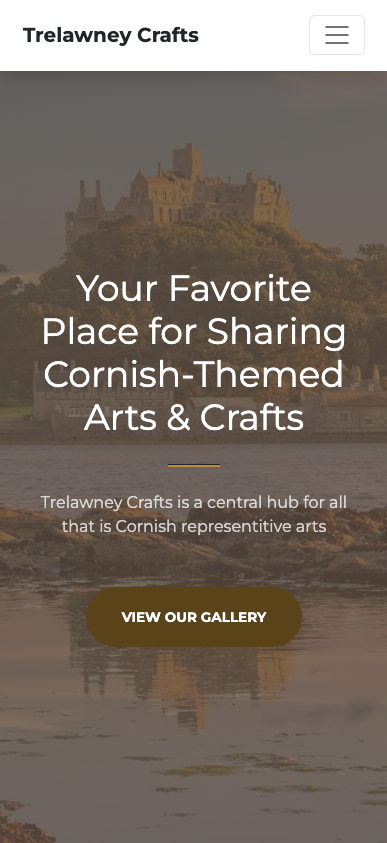

# [Trelawney Crafts]()

 

 

This is a project for the Code Institute Milestone Project 3. Trelawney Crafts is a website with the purpose of serving as a portfolio for arts and crafts.

The users of this website will be able to upload images and information regarding their most recent pieces, allowing for others to view them in a gallery-style page.

---

## Table of Contents
1. [**UX**](#ux)
    - [**User Stories**](#user-stories)
    - [**Design**](#design)
        - [**Color Scheme**](#color-scheme)
        - [**Imagery**](#imagery)
        - [**Typography**](#typography)
    - [**Wireframes**](#wireframes)
    - [**Database Design**](#database-design)
2. [**Features**](#features)
    - [**Current Features**](#current-features)
    - [**Planned Features**](#planned-features)
3. [**Technologies Used**](#technologies-used)
    - [**Development Technologies**](#development-technologies)
    - [**Front-End Technologies**](#front-end-technologies)
    - [**Back-End Technologies**](#back-end-technologies)
4. [**Testing**](#testing)
    - [**Validation**](#validation)
    - [**User Story Testing**](#user-story-testing)
    - [**Compatibility**](#compatibility)
---

## UX

### User Stories

-   #### As A First-Time Visitor, I want to:

    -   View the site irrespective of what device or browser I am using.
    -   Be able to view Arts & Crafts created by content uploaders.
    -   Create my own account on the website.

-   #### As A Returning Visitor, I want to:

    -   Update my profile information, such as my name or password.
    -   Be able to freely log in and out of my account.
    -   Post a comment or reaction to other user's posts.

-   #### As A Frequent Visitor, I want to:

    -   Upload my own photos of Artwork I made.
    -   Sort the uploaded items by order of popularity.
    -   Reply to comments that people have left on my posted artwork.

### Design

This web application will be designed to have an elegant and artistic theme, whilst containing elements of Cornwall hidden within.

In order to speed up development, the [Creative Bootstrap Template](https://startbootstrap.com/theme/creative) will be used as it provides a foundation on which to develop.

#### Color Scheme

To keep in line with the Cornish Theme, the app will follow a colour scheme similar to that of Cornish Tartan.

*Palette*: **Extracted From Above Image**

| 1 | 2 | 3 | 4 | 5 | 6 | 7 |
| :---: | :---: | :---: | :---: | :---: | :---: | :---: |
|  |  |  |  |  |  |  |
| #A61C35 | #BF8E34 | #594319 | #F2F2F2 | #0D0D0D | #1F5B73 | #3BACD9 |

The above table was extracted from the image using [Adobe Color](https://color.adobe.com/create/image) by uploading the image and selecting the colours extracted from the image.

These will be placed as *:root* variables within the style.css file in order to be used across all necessary elements.

#### Imagery

Any imagery used on the website will be pictures of places in Cornwall, keeping with the theme. 

The users will be able to upload and manage images themselves which will be displayed in the gallery.

#### Typography

The main font that will be applied to the web application is [Montserrat](https://fonts.google.com/specimen/Montserrat), with a fallback font of **Sans-Serif**.

### Wireframes

[**Desktop Wireframe**](./design/desktop-wireframe.png)

[**Mobile Wireframe**](./design/mobile-wireframe.png)

The mobile version will follow the same principles as the desktop design, however the nav bar will expand once the icon is clicked so that it does not take up too much of the screen.

### Database Design

Below is the schema design for the database that will hold and handle *Users*, *posts* made by those users and *comments/reactions* on the posts.

There is also another table in order to store the names of *categories*

This is a relational database handled by [PostgreSQL](https://www.postgresql.org/) which uses primary and foreign keys from each table in order to relate entries to eachother.

## Features

In lieu with the project requirements, I have implemented all necessary features. The below is a list of current features on the site and how they align to the requirements.

### Existing Features

-   **Creating A User Account** - Any user of the site can create an account on the website which allows them to perform more login-required actions. The user accounts are stored within the `user` database table

-   **Updating Account Details** - Once the user has a created account and has logged in, they can view their account page in order to update their details such as their username or email. This allows them to have restricted editing access over their own entry within the `user` table.

-   **Viewing Of Posts** - On the `gallery` page, users are able to view the posts created by other users in order of *most recent first*.

-   **Reacting To Posts** - If a user is logged in, they are able to "React" to a post, similar to a "like" on social media. This reaction is stored within the `reaction` table and is linked to the post via a relationship field.

-   **Commenting On Posts** - If a user is logged in, they are able to comment on a post, which will store their username and comment content within the `comment` database table and will be linked to the post they left it on. Other users will then be able to view their comments as part of the same post.

-   **Creating A Post** - If a user is logged in, they can create their own post by uploading a photo and providing a title, category and any more information about the post that they wish. This is then checked and stored within the `post` database table and will appear on the Gallery page.

-   **Deleting A Post** - If a user is logged in, they will be able to delete only their own posts on the gallery page. A 'Delete' icon will be displayed within the post if the logged in user is the creator of that specific post. This will delete the post from the `post` database table, and will CASCADE in order to delete any related reactions or comments.

-   **Deleting Of Comments** - If a user is logged in, they are able to delete comments posted by themself in a similar fashion to deleting posts.

### Planned Features

-   **Deleting User Account** - Once logged in, the user is able to delete their account using the 'account' page in order to permanently remove their account from the database and the website.

-   **Sorting Posts By Popularity** - Within the posts on the gallery page, the user is able to sort the returned posts by order of popularity.

## Technologies Used

### Development Technologies

- 
    - [Balsamiq](https://balsamiq.com/) - Balsamiq was used in order to create intuitive wireframes during the initial design process.
- 
    - [GitHub](https://github.com/) - GitHub was used to store and manage the project within a combined online repository.
- 
    - [VS Code](https://code.visualstudio.com/) - Visual Studio Code was used as the primary development environment for the project.

### Front-End Technologies

- 
    - [HTML5](https://developer.mozilla.org/en-US/docs/Web/Guide/HTML/HTML5) - HTML5 was used as the primary markup language in order to structure and display the elements on the page.
- 
    - [CSS3](https://developer.mozilla.org/en-US/docs/Web/CSS/CSS3) - CSS Was used in order to provide styling to the web pages with custom colours and sizes of elements.
- 
    - [Bootstrap 4.3.1](https://getbootstrap.com/docs/4.3/getting-started/introduction/) - Bootstrap was used to quickly design and create the layout and look of the website.
- 
    - [jQuery 3.3.1](https://code.jquery.com/jquery/) - jQuery was used in conjunction with bootstrap to apply javascript selectors and updating elements more efficiently.

### Back-End Technologies

- 
    - [Python 3.11.2](https://www.python.org/) - Python was used as the back-end management language to pass and handle data to and from the application.
- 
    - [Flask 2.2.0](https://flask.palletsprojects.com/en/3.0.x/) - Flask is a python module and was used to create the web server and to manage and handle the applicaiton routing.
- 
    - [PostgreSQL 16.1](https://www.postgresql.org/) - PostgreSQL was used as the database in this project in order to store information regarding users, posts and the attributed data to them.

## Testing

Various testing methods and processes were used in order to ensure the website not only functioned as expected, but the code itself conforms to standards.

Testing the site across different devices and browsers allowed the site to be used by anyone irrespective of their device parameters.

### Validation

**HTML**

All HTML files were checked using the [W3C HTML](https://validator.w3.org/) Validator. As the validator does not recognise Jinja templating, the pages were checked via their URL's once the project was deployed.

Any errors that were identified were rectified, and checked again once the project was redeployed.

CLICK HERE to view screenshots of the validation pages

**CSS**

The CSS was checked using the [W3C CSS](https://jigsaw.w3.org/css-validator/#validate_by_uri) Validation service and returned no critical errors.

Warnings were returned, however these were due to rules such as `-webkit-text-size-adjust` being vendor extensions.

**JavaScript**

- `post.js` - A few errors were present, however they were fixed in Commit ID `2809e4d`

- `script.js` - One error pertains regarding a stay '.', however this is requred for the script.

- `gallery-actions.js` - A few warnings were identified when validating this file, however they were due to "Undefined '$'". This was due to jQuery not being included in the validator so they were ignored.

- `account-management` - Similar to above, all warnings excepts the ones relating to jQuery were fixed.

### User Story Testing

In this section, The previously defined user stories will be revisited in order to ensure they have been met accordingly.

-   #### As A First-Time Visitor, I want to:

    -   View the site irrespective of what device or browser I am using.

        The site was developed with **'Mobile-First'** in mind, meaning that the elements and how they were styled were created in such a manner that whilst being visible on desktop devices, they would also be visible on other devices, screen sizes and browsers.

        Using the Chrome Developer Tools during the devlopment process, the web page was manually tested to ensure all required elements were visible when needed and the site was responsive.
        

        
        

    -   Be able to view Arts & Crafts created by content uploaders.

        Within the site, there is the `galley.html` page, which upon loading, queries the `post` database table and loads each user post to the page.

        This is done by passing the posts from the flask back end, before being loaded into the web page using jinja templating with a `for loop` to load each post.

        Hovering the mouse over, or tapping on it on a mobile device will reveal more information about the post itself.

        

        
        

    -   Create my own account on the website.

        The registration page on the site allows users to sign up by creating a username, providing an email address, and also a password.

        Before the user account is created, the database is checked to ensure that the current user information has not been used. This is so that usernames and emails can be unique and not repeated between accounts.

        

        
        

        Once the users account has been created, they can log in to access more features within the site.

        The user account is stored and retrieved from the 'user' table within the PostgreSQL database.

-   #### As A Returning Visitor, I want to:

    -   Update my profile information, such as my name or password.

        Once the user has created and logged into their account, they are able to access their account information allowing them to update certain profile information, such as their username or password.

        Much like the creation of the account, the details are first checked within the database to ensure there is no duplication of email addresses or usernames before updating that user's record within the 'user' table.

        

        
        

    -   Be able to freely log in and out of my account.

        Any user with a created account is able to log in and out as they please using the buttons available in the navigation bar/menu.

        Clicking the "Log Out" button will instantly log out the user and return them to the home page. They are then again able to log back into their account afterwards.

        

        
        

    -   Post a comment or reaction to other user's posts.

        If a user is logged in, they are able to post comments as part of other user made posts. This is made possible by clicking the "Comment" icon, and entering their own personal comment in the pop up screen.

        The user is also able to remove their own comment, thus deleting it from the database using the bin icon next to their comment.

        The comment is immediately reflected on the users page, as well as incrementing the number of comments on that particular post.

        

        
        

-   #### As A Frequent Visitor, I want to:

    -   Upload my own photos of Artwork I made.

    -   Sort the uploaded items by order of popularity.

    -   Reply to comments that people have left on my posted artwork.

### Compatibility